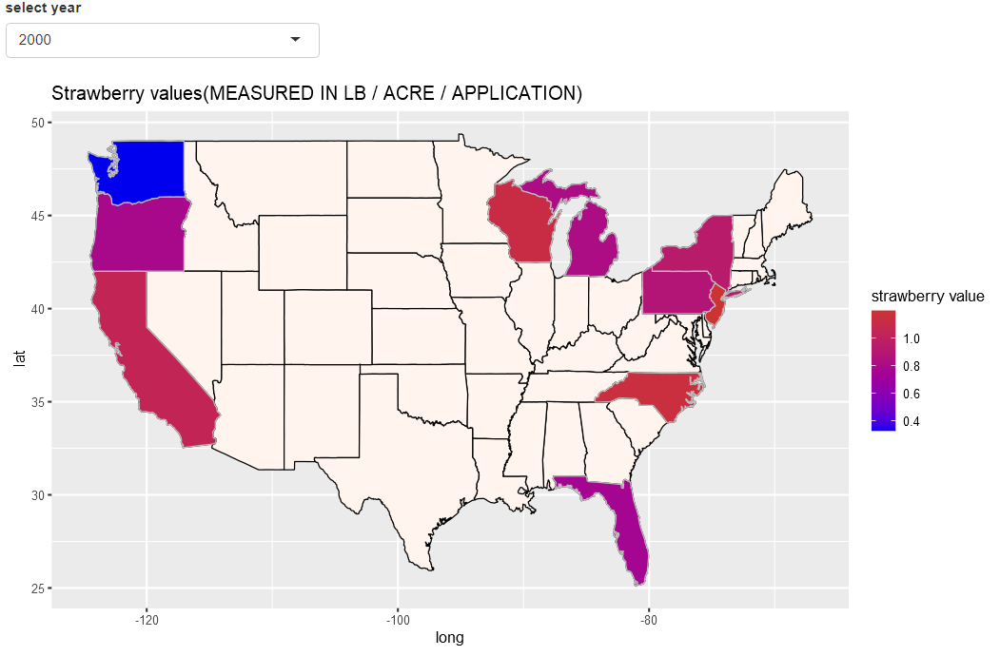

```{r setup, include=FALSE}
knitr::opts_chunk$set(echo = FALSE)
Sys.setenv("LANGUAGE" = "EN")
Sys.setlocale("LC_ALL", "C")
library(dplyr)
library(tidyverse)
library(magrittr)
library(ggplot2)
library(ggiraph)
```


```{r, include = FALSE}
source("data_and_eda.R")
```

## 1. Introduction
Our research questions about the strawberry production and chemical use in the US are:  
i) Does the type of chemical have a correlation to the amount of strawberries produced (Measured in lb/ acre/ application)?  
ii) Do different states use different chemicals?  
iii) How do the amount of strawberries produced differ by state?  
To answer these questions, we looked up two data sets, cleaned and merged them into one data set, and created graphs, tables and maps for Exploratory Data Analysis (EDA).

## 2. Methods
### i) Data set
We used two data sets,USDA strawberry data and pesticide data. For the strawberry data set, the provided one in the class does not seem to be enough for our research in terms of information on each state production, so we looked up the data on the USDA web site again and got the data set which include in total 10215 observations of strawberry data in 10 states.  
For the pesticide data, we adopted the provided data.   
Finally, we combined these two data sets, deleted rows with no information, and selected the variables needed for EDA.

### ii) Exploratory Data Analysis
*EDA by chemical type*
  
  First we analyzed the data set making bar chart, violin and box plot, and density graph by chemical type to see if there is any difference in the amount of strawberry production between the two chemical types.

*EDA by year and state* 
  
  We also analyzed the data in terms of the amount of strawberry production by year and state where we make use of shiny application which allows us to explore strawberry production trends in each state and year more easily. 

*EDA by toxicity level*  
  
  Finally we analyzed the data in terms of the amount of strawberry production by toxicity level.

## 3. Results


### EDA by chemical type

```{r, warning=FALSE, message=FALSE}
chem_year_valueq
```
<br>
For both fungicide and insecticide, the value generally goes down every year, which we can see from the increasing 1st quartile (pink) and decreasing 4th quartile (purple).    
  
<br><br><br><br><br><br><br><br>


```{r, echo = FALSE, warning=FALSE, message=FALSE}
violin
```
  
Insecticide has higher mean and median value, but fungicide has a larger spread. Fungicide corresponds with lower strawberry production but has larger spread.Insecticide has higher values.

<br><br><br><br><br><br><br><br>

### EDA by year and state
```{r, echo = FALSE, warning=FALSE, message=FALSE}
p_f
```
  
The trend of strawberry production per acre per application decreases over time, which corresponds to the fig.1 result.


```{r, echo = FALSE, warning=FALSE, message=FALSE}
p_i
```
  
This plot also shows the down trend, but the value for California levels off after 2010.

### EDA by toxicity level
```{r, echo = FALSE, warning=FALSE, message=FALSE}
toxic1
```
These graphs show the distribution of the amount of strawberry production per acre per application by toxicity type. For the chemical toxic to bee, there seems to be a correlation between high toxic chemical and the amount of strawberry production. For the other chemicals toxic to human, know carcinogen, hormone disruptor and neurotoxins seem to have high strawberry production per acre per application.  

```{r, echo = FALSE, warning=FALSE, message=FALSE}
toxic2
```
  These graphs show the distribution of the amount of strawberry production per acre per application by state, focusing on California. For the both chemical types, California seems to have high amount of strawberry production per acre per application, especially around the value of 2 (lb/ acre/ application).  
  
  ```{r, echo = FALSE, warning=FALSE, message=FALSE}
toxic3
```
  These graphs show the distribution of the amount of strawberry production per acre per application by toxicity type in California. Based on the previous two sets of graphs, there seems to be some correlation between high bee toxic chemicals, known carcinogen, and some human toxic chemicals and the amount of strawberry production as well as California and the amount of strawberry production. So we look at the distribution of the amount of strawberry production by toxicity type in California. We also see some correlation between high bee toxic chemicals, known carcinogen, and some human toxic chemicals and the amount of strawberry production even within California, which suggests there seems to be some correlation between the chemical types and the amount of strawberry production when adjusted for states.





## 4. Conclusion
- Strawberry produced by acre by application has decreased over time. 
- California used to be the top producer
- Florida is overtaking California
- High toxic chemical for bee seemed to be correlated with larger strawberry production. 
